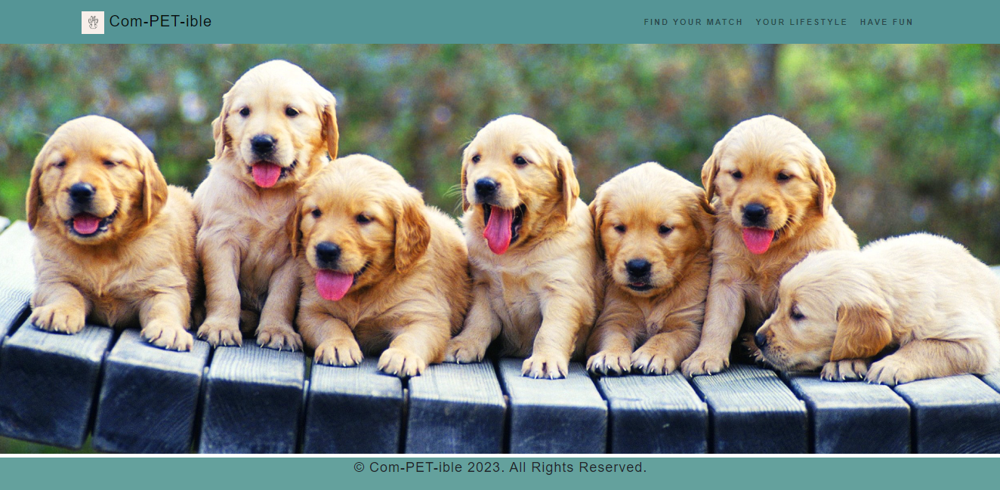

# Com-PET-ible

A simple Web Application for dog owners to select the best matched dog breed to suit their lifestyle . This will allow the user to visit the website before buying or adopting and making the correct choice.

## Getting Started:

Simply open up the deployed link [Com-PET-ible](https://realstranger01.github.io/Com-PET-ible/) and explore the website:



### Prerequisites

You need to have a modern browser able to handle html5 and css.

Some popular browsers are:
```

Google Chrome
Mozilla Firefox
Safari
Opera
Edge
```
### Description

For this team project, we have created an interactive web application using Bootstrap as the front-end framework. The application will be deployed to GitHub Pages and will be responsive to different screen sizes.

The application will accept and respond to user input, making use of modals for user interaction instead of traditional alerts, confirms, or prompts. Client-side storage will be utilized to store persistent data, allowing for a better user experience.

We have utilized at least two server-side APIs to enhance the functionality of our application. A clean and well-structured repository is essential, adhering to quality coding standards, including proper file structure, naming conventions, and best practices for class/id naming conventions, indentation, and quality comments.

The application will have a polished user interface, ensuring an enjoyable experience for our users. Our README will include all relevant information, including a unique name, description, technologies used, screenshot, and a link to the deployed application.

### Installation

The intallation process consisted of:
```

* Application deployed at live URL.

* Application loads with no errors.

* GitHub repository contains application code.
```

### What We Learned

As a team, we learned the importance of utilizing frameworks such as Bootstrap for creating an interactive and responsive web application. We gained a deeper understanding of server-side APIs and how they can enhance the functionality of our application. We also learned the importance of using modals for user interaction and client-side storage for storing persistent data. Overall, this project taught us the importance of utilizing best practices and standards in web development, leading to a more professional and effective final product.

## Built With

* Bootstrap

* CSS

* Javascript

## licence

Please refer to the licence in the repo.

## Author

* Hamza - Intial work - [RealStranger](https://github.com/Realstranger01/Com-PET-ible.git)
* Dragos - Intial work - [DrGoshD](https://github.com/Realstranger01/Com-PET-ible.git)
* Kelen - Intial work - [kelenyathi](https://github.com/Realstranger01/Com-PET-ible.git)


